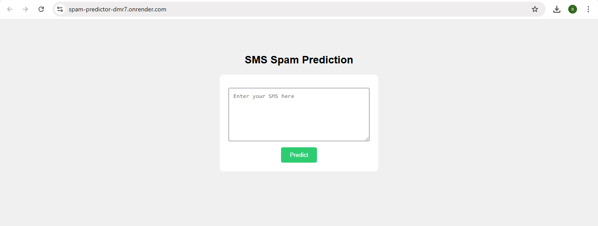
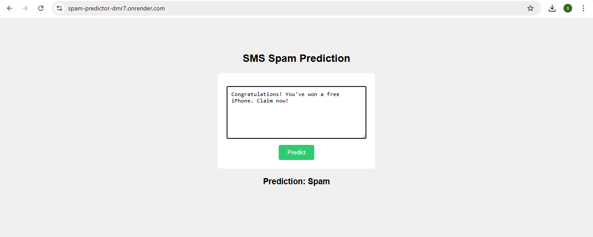
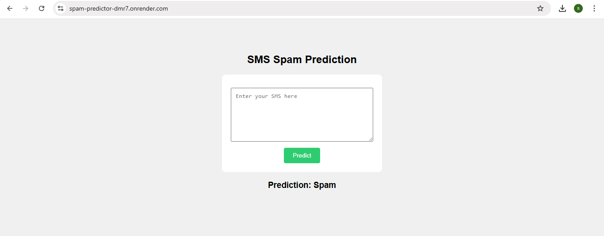

# Iris-flower-prediction

A Flask web app that uses a Decision Tree Classifier to predict the species of an iris flower based on petal and sepal dimensions. Built using the classic Iris dataset, this app provides a clean UI for real-time predictions and is deployed using Render.

---

## Features

- Real-Time Prediction: Predicts iris flower species based on user-input features like sepal and petal dimensions.
- Decision Tree Model: Uses a trained Decision Tree Classifier on the Iris dataset for accurate classification.
- Flask Web Interface: Simple and interactive web form built with Flask and HTML/CSS.
- Cloud Deployment: Fully deployed on Render for public access via a live URL.
- Clean Project Structure: Organized codebase with separate training script, templates, static assets, and model files.


---

## Prerequisites

Make sure the following are installed:

- Python 3.7 or higher installed
- Git installed and configured
- Basic knowledge of Python and Flask
- A GitHub account (for code hosting)
- Render account (for deployment)

---

## Installation

### 1. Clone the repository

```
git clone https://github.com/sandhiya0147/Iris-flower-prediction.git
cd Iris-flower-prediction
```

### 2. Install dependencies

```
pip install -r requirements.txt
```

---

## Running the Application

Start the Flask development server:

```
python app.py
```

Then open your browser and go to:

```
http://127.0.0.1:5000
```

---

## How It Works

- Data Loading: The Iris dataset is loaded using sklearn.datasets.load_iris() in the training script.
- Model Training: A Decision Tree Classifier is trained on the dataset and saved as model.pkl.
- User Input: Users enter sepal and petal measurements into a form on the Flask web page.
- Prediction: The input values are passed to the trained model, which predicts the flower species.
- Result Display: The predicted species (Setosa, Versicolor, or Virginica) is shown on the web page instantly.

---

## File Structure

```
Iris-flower-prediction/
├── assets/                     
│   ├── filled_input.png
│   ├── input_form.png
│   └── predicted_result.png
│
├── static/                      
│   └── style.css
│
├── templates/                   
│   └── index.html
│
├── Iris.csv                     
├── Procfile                     
├── README.md                    
├── app.py                       
├── model.pkl                    
├── model_train.py              
├── requirements.txt             
└── target_names.pkl             
```

---

## Future Improvements

- Add input validation to prevent errors and improve user experience.
- Visualize the decision tree and model accuracy for better understanding.
- Allow users to switch between multiple machine learning models.
- Make the UI mobile-friendly using responsive design frameworks.
- Store predictions and inputs in a database for future analysis.

---


## Step-by-Step Guide: How to Use the Movie Interest Predictor


### Step 1: Input Form
  

### Step 2: Filled Form 
  

### Step 3: Prediction Result


---

## Live Demo

[Click here to view the deployed app](https://iris-flower-prediction-bcqy.onrender.com)

---
